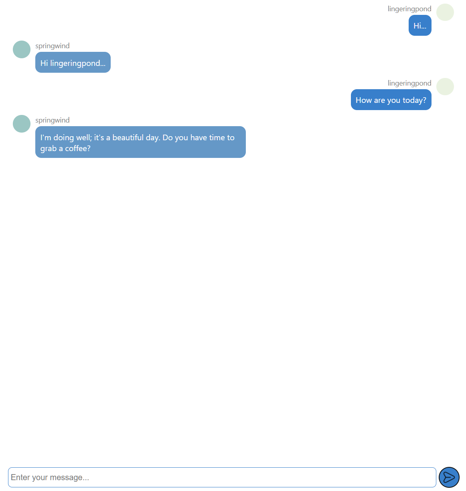

# 💬 Chat App

A modern web-based chat application built with **React** as my final project during the Front-End Development course at Algebra.

The application allows users to communicate with each other directly through the browser. Users can simply open the application link and start chatting.

## 🚀 Live Demo

🔗https://ivanposavi.github.io/chat-app/

---

## 📸 Preview



> Add a screenshot of the application to the `screenshots` folder and name it `chat-app.png`.

---

## ✨ Features

* 💬 Real-time user communication
* 👤 Multiple users can join the chat
* 🌐 Accessible directly through a web browser
* 📱 Responsive user interface
* ⚛️ Built with React
* 🔄 Dynamic chat updates
* 🎨 Clean and simple interface

---

## 🛠️ Built With

* **React**
* **JavaScript**
* **HTML5**
* **CSS3**

---

## 📂 Project Structure

```text
chat-app/
│
├── public/
├── src/
│   ├── components/
│   ├── ...
│
├── package.json
└── README.md
```

> The exact structure may vary depending on the current version of the project.

---

## ⚙️ Getting Started

### 1. Clone the repository

```bash
git clone https://github.com/IvanPosavi/chat-app.git
```

### 2. Navigate to the project

```bash
cd chat-app
```

### 3. Install dependencies

```bash
npm install
```

### 4. Start the development server

```bash
npm run dev
```

The application will then be available locally in your browser.

---

## 🎯 Project Purpose

This project was created as my **final project for the Front-End Development course at Algebra**.

The main goal was to apply the knowledge gained during the course and build a functional React application that allows users to communicate through a web browser.

Through this project, I gained practical experience with:

* React application development
* Component-based architecture
* Managing application state
* Working with user interactions
* Building responsive interfaces
* Using Git and GitHub
* Developing and testing a complete web application

---

## 🔮 Future Improvements

Possible improvements for future versions include:

* 🔐 User authentication
* 👤 User profiles
* 🟢 Online/offline status
* 🕒 Message timestamps
* 🗑️ Delete or edit messages
* 📎 File and image sharing
* 🔔 Notifications
* 🌙 Dark mode
* 📱 Further mobile UI improvements

---

## 👨‍💻 Author

**Ivan Posavi**

Front-End Developer

🔗 [GitHub](https://github.com/IvanPosavi)

---

### 💡 Built with React while learning, experimenting, and improving.


# Getting Started with Create React App

This project was bootstrapped with [Create React App](https://github.com/facebook/create-react-app).

## Available Scripts

In the project directory, you can run:

### `npm start`

Runs the app in the development mode.\
Open [http://localhost:3000](http://localhost:3000) to view it in your browser.

The page will reload when you make changes.\
You may also see any lint errors in the console.

### `npm test`

Launches the test runner in the interactive watch mode.\
See the section about [running tests](https://facebook.github.io/create-react-app/docs/running-tests) for more information.

### `npm run build`

Builds the app for production to the `build` folder.\
It correctly bundles React in production mode and optimizes the build for the best performance.

The build is minified and the filenames include the hashes.\
Your app is ready to be deployed!

See the section about [deployment](https://facebook.github.io/create-react-app/docs/deployment) for more information.

### `npm run eject`

**Note: this is a one-way operation. Once you `eject`, you can't go back!**

If you aren't satisfied with the build tool and configuration choices, you can `eject` at any time. This command will remove the single build dependency from your project.

Instead, it will copy all the configuration files and the transitive dependencies (webpack, Babel, ESLint, etc) right into your project so you have full control over them. All of the commands except `eject` will still work, but they will point to the copied scripts so you can tweak them. At this point you're on your own.

You don't have to ever use `eject`. The curated feature set is suitable for small and middle deployments, and you shouldn't feel obligated to use this feature. However we understand that this tool wouldn't be useful if you couldn't customize it when you are ready for it.

## Learn More

You can learn more in the [Create React App documentation](https://facebook.github.io/create-react-app/docs/getting-started).

To learn React, check out the [React documentation](https://reactjs.org/).

### Code Splitting

This section has moved here: [https://facebook.github.io/create-react-app/docs/code-splitting](https://facebook.github.io/create-react-app/docs/code-splitting)

### Analyzing the Bundle Size

This section has moved here: [https://facebook.github.io/create-react-app/docs/analyzing-the-bundle-size](https://facebook.github.io/create-react-app/docs/analyzing-the-bundle-size)

### Making a Progressive Web App

This section has moved here: [https://facebook.github.io/create-react-app/docs/making-a-progressive-web-app](https://facebook.github.io/create-react-app/docs/making-a-progressive-web-app)

### Advanced Configuration

This section has moved here: [https://facebook.github.io/create-react-app/docs/advanced-configuration](https://facebook.github.io/create-react-app/docs/advanced-configuration)

### Deployment

This section has moved here: [https://facebook.github.io/create-react-app/docs/deployment](https://facebook.github.io/create-react-app/docs/deployment)

### `npm run build` fails to minify

This section has moved here: [https://facebook.github.io/create-react-app/docs/troubleshooting#npm-run-build-fails-to-minify](https://facebook.github.io/create-react-app/docs/troubleshooting#npm-run-build-fails-to-minify)
